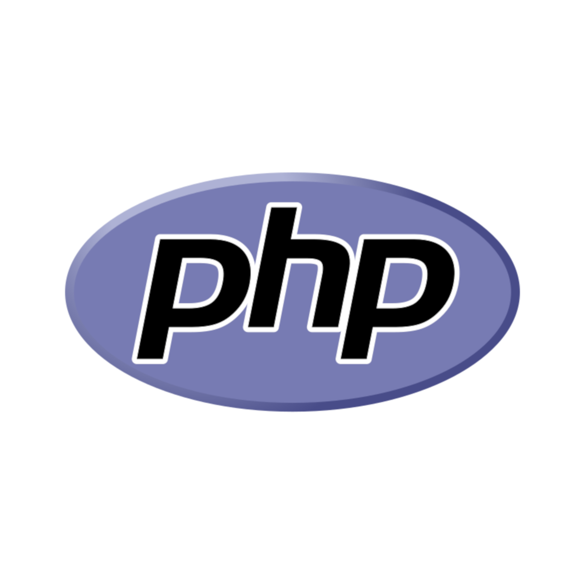
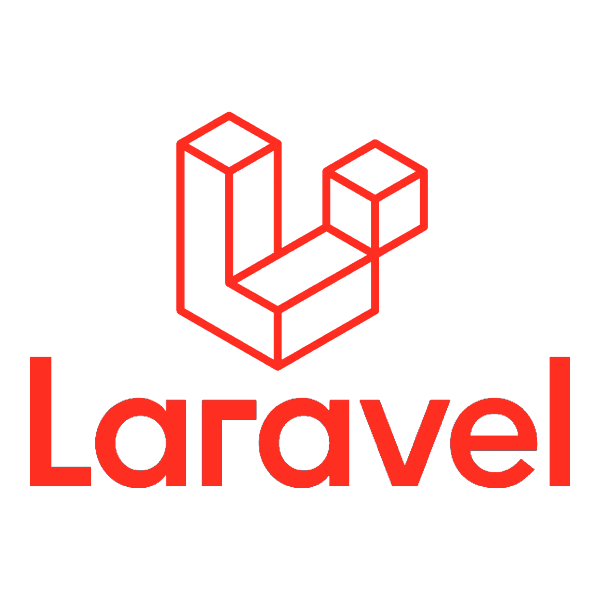
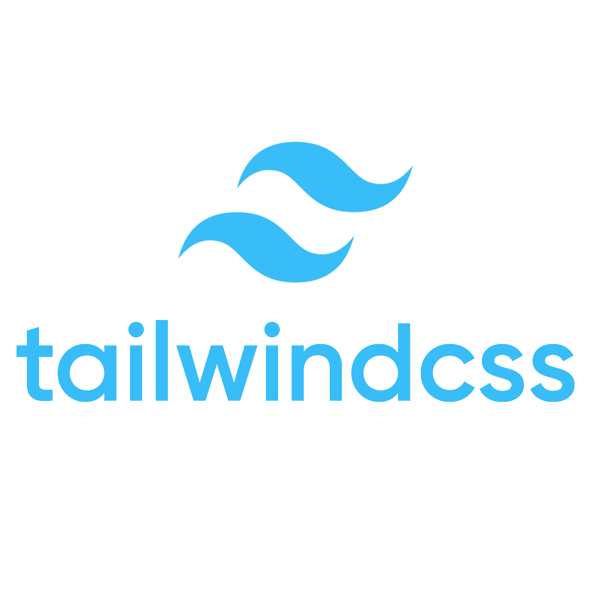

# Mundito Spanish

A Spanish language learning platform built with Laravel, focusing on comprehensive points of sale for learning programs for children.


<p align="center">
  
  &nbsp;&nbsp;&nbsp;&nbsp;&nbsp;
  
  &nbsp;&nbsp;&nbsp;&nbsp;&nbsp;
  
  &nbsp;&nbsp;&nbsp;&nbsp;&nbsp;
  
  &nbsp;&nbsp;&nbsp;&nbsp;&nbsp;
  
</p>

## Overview

Mundito Spanish is a web application designed to make learning Spanish fun and engaging for children. Built with Laravel, Blade, Alpine.js, and React components, it offers a modern experience while maintaining a childish theme.

## Features

-   **Authentication System**: Secure user registration and login via Laravel Breeze
-   **Interactive Learning Modules**: Spanish vocabulary, grammar, and pronunciation lessons
-   **Progress Tracking**: Track learning progress over time
-   **Responsive Design**: Tailwind CSS for a fully responsive experience
-   **Hybrid Frontend**: Blade templates with Alpine.js for simple interactions, React components for complex interactive elements

## System Requirements

-   PHP 8.1 or higher
-   MySQL 5.7 or higher
-   Composer
-   Node.js & npm
-   WSL2 with Ubuntu (for Windows users)

## Development Environment

This project uses a hybrid development environment:

-   **WSL2 (Ubuntu)**: Runs Apache web server and PHP
-   **Windows**: Runs MySQL via WampServer
-   **VS Code**: Used with Remote-WSL extension for editing

## Installation

1. **Clone the repository**

    ```bash
    git clone https://github.com/yourusername/mundito-spanish.git
    cd mundito-spanish
    ```

2. **Install PHP dependencies**

    ```bash
    composer install
    ```

3. **Install JavaScript dependencies**

    ```bash
    npm install
    ```

4. **Create environment file**

    ```bash
    cp .env.example .env
    php artisan key:generate
    ```

5. **Configure environment variables**
   Edit `.env` to set your:

    - Database credentials
    - Application URL
    - Mail settings

6. **Run migrations**

    ```bash
    php artisan migrate
    ```

7. **Build assets**

    ```bash
    npm run build
    ```

8. **Configure the web server**
   See `docs/dev-environment.md` for detailed setup instructions

## Running the Application

### Using the startup script

```bash
./start.sh
```

### Manually

1. Start WampServer on Windows
2. Start Apache in WSL
3. Access via browser: http://mundito-spanish.local:8080

## Directory Structure

```
mundito-spanish/
├── app/                  # Application code
│   ├── Console/          # Artisan commands
│   ├── Exceptions/       # Exception handlers
│   ├── Http/             # Controllers, middleware, requests
│   ├── Models/           # Eloquent models
│   ├── Providers/        # Service providers
│   └── View/             # View components
├── bootstrap/            # Framework bootstrap files
├── config/               # Configuration files
├── database/             # Migrations and seeders
├── public/               # Web-accessible files
│   └── index.php         # Application entry point
├── resources/            # Uncompiled assets
│   ├── css/              # CSS files
│   ├── js/               # JavaScript files
│   │   └── react/        # React components
│   └── views/            # Blade templates
├── routes/               # Route definitions
├── storage/              # Storage for logs, cache, etc.
├── tests/                # Tests (using Pest)
└── vendor/               # Composer dependencies
```

## Adding New Features

### Creating a new page

1. Add a route in `routes/web.php`
2. Create a controller method
3. Create a Blade view

### Adding a React component

1. Create component in `resources/js/react/components/`
2. Use it in Blade templates with:
    ```blade
    <x-react-component
       component="YourComponentName"
       :props="['propName' => 'value']"
    />
    ```

## Development Tools

-   **Laravel Breeze**: Authentication scaffolding
-   **Laravel IDE Helper**: Better IDE support
-   **Laravel Telescope**: Application debugging and insights
-   **Pest**: Testing framework
-   **Tailwind CSS**: Utility-first CSS framework
-   **Alpine.js**: Lightweight JavaScript framework
-   **React**: For complex interactive components

## Contributing

1. Fork the repository
2. Create a feature branch: `git checkout -b feature-name`
3. Commit your changes: `git commit -am 'Add some feature'`
4. Push to the branch: `git push origin feature-name`
5. Submit a pull request

## License

This project is licensed under the MIT License - see the LICENSE file for details.
